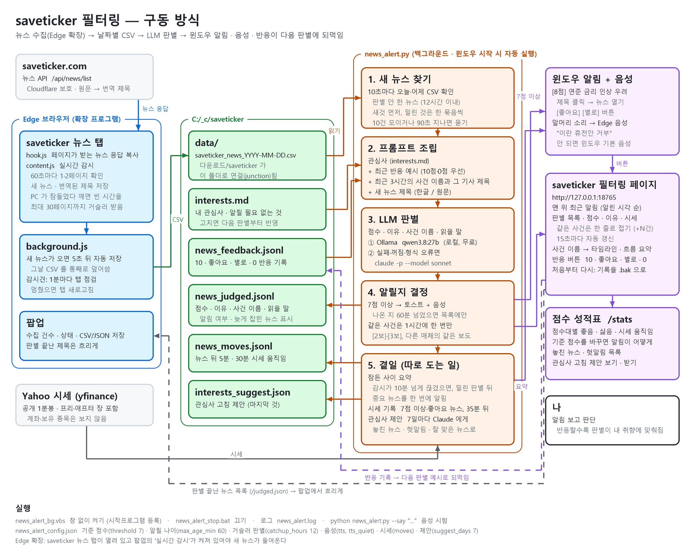
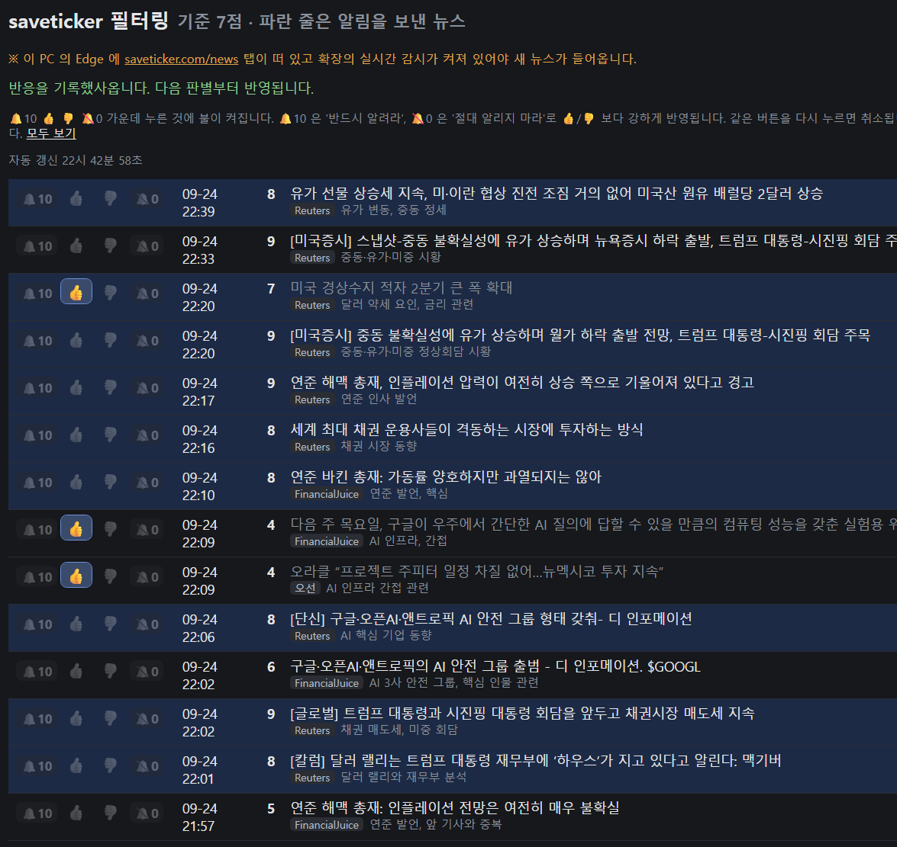
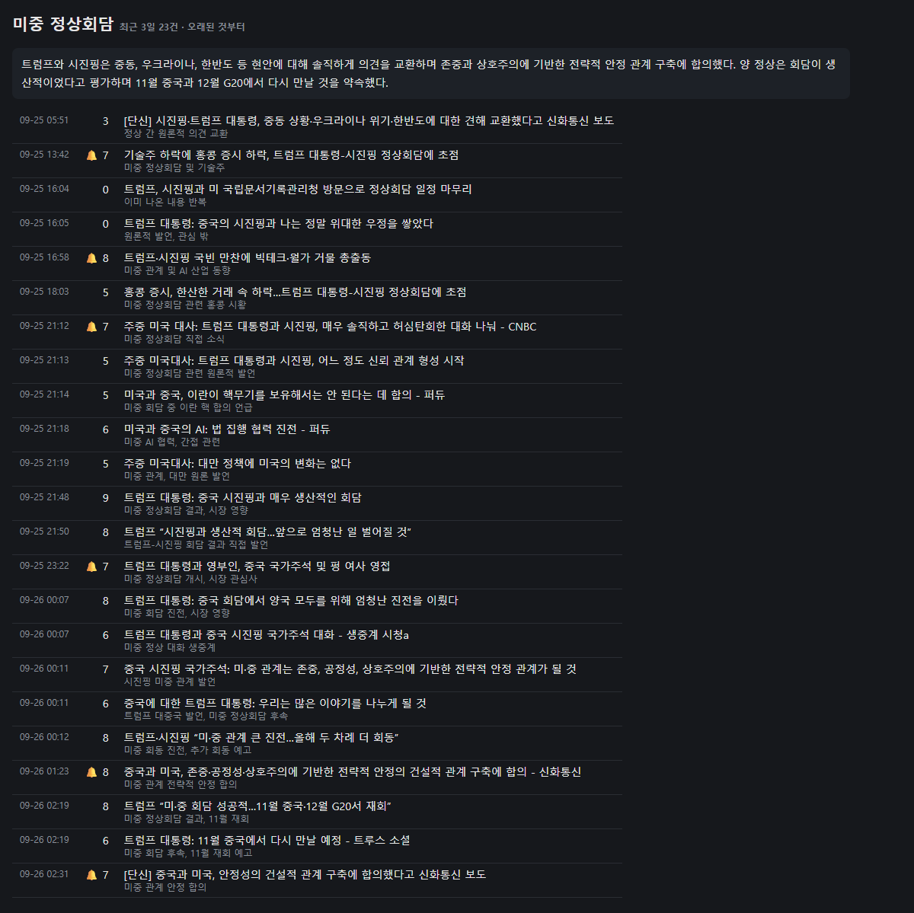
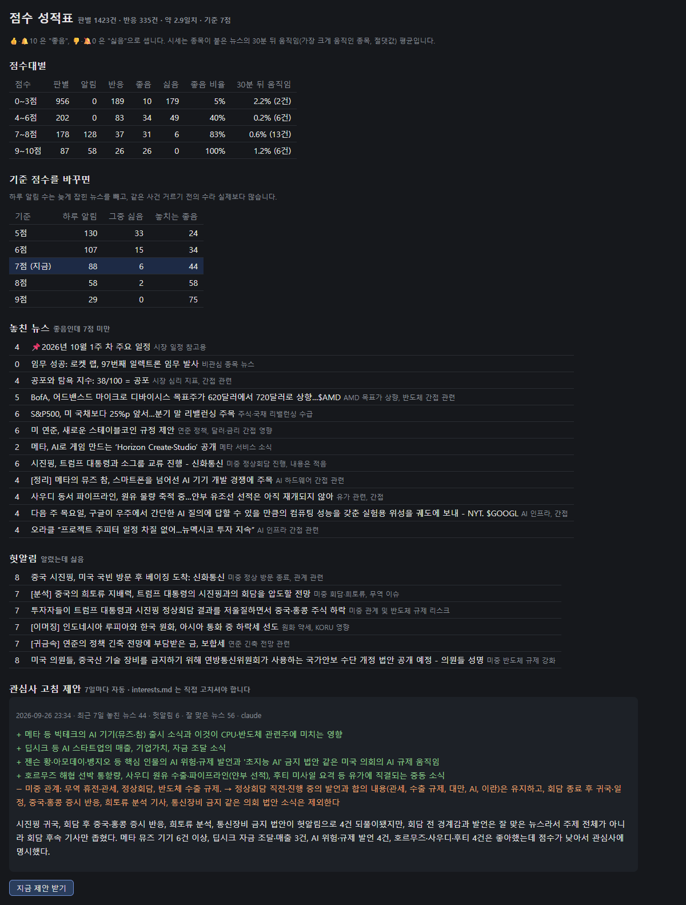
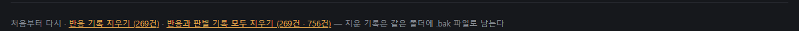

# saveticker 필터링

[세이브티커](https://saveticker.com/news) 뉴스를 모아서, LLM 이 내 관심사에 맞는 것만 골라 윈도우 알림으로 알려준다.

## 왜 만들었나

오선님의 세이브티커에 요즘 뉴스가 많이 늘었다. 그러다보니 내가 관심 없는 뉴스도 너무 많이 올라와서,
적당히 걸러 주는 페이지가 필요했다. 관심 있는 뉴스만 알림으로 받고, 👍/👎 로 반응할수록
내 취향에 맞게 걸러지도록 만들었다.

## 주의 사항

1. **PC 의 Edge 에 https://saveticker.com/news 탭이 떠 있어야 한다.**
   뉴스는 이 탭 안에서 확장 프로그램이 모은다. 탭을 닫거나 Edge 를 끄면 새 뉴스가 들어오지 않고,
   판별과 알림도 멈춘다. 확장 팝업의 **실시간 감시** 도 켜 두어야 한다.



```
Edge 확장 (extension/)          news_alert.py
  saveticker 뉴스 탭에서         data/*.csv 를 지켜보다가
  새 뉴스 수집 ──────────▶  날짜별 CSV  ──▶  LLM 판별 (ollama → 안 되면 claude CLI)
                              data/             7점 이상이면 윈도우 토스트 + 음성
                                                http://127.0.0.1:18765  판별 목록 · 🔔10 👍 👎 🔕0 반응
```

## 화면

`http://127.0.0.1:18765` 의 판별 목록. 점수·이유·제공처·사건 이름(보라색)이 보이고, 왼쪽 🔔10 · 👍 · 👎 · 🔕0 으로 반응한다.
파란 줄은 알림을 보낸 뉴스, 어두운 제목은 이미 반응한 뉴스.
같은 사건의 뉴스는 한 줄로 접히고, **같은 사건 +N건** 을 누르면 펼쳐진다 (아래는 "후티 반군 드론 공격" 7건을 펼친 모습).
맨 위 파란 띠는 **최근 알림**이다.



## 구성

| 파일 | 역할 |
|---|---|
| `extension/` | Edge/Chrome 확장. 페이지가 받는 `/api/news/list` 응답을 기록하고, 실시간 감시로 1·2페이지를 주기적으로 확인한다. PC 가 잠들었다 깨는 등으로 빈 시간이 생기면 최대 30페이지까지 거슬러 받는다. 날짜별 CSV 를 `다운로드\saveticker\` 에 저장한다 |
| `news_alert.py` | CSV 의 새 뉴스를 판별해 알림을 띄우고, 판별 목록 페이지를 연다 |
| `interests.md` | 판별 기준이 되는 관심사. 고치면 다음 판별부터 반영된다 |
| `news_alert_config.json` | 모델, 기준 점수, 포트 등 설정 |
| `news_alert_bg.vbs` / `news_alert_stop.bat` | 창 없이 백그라운드 실행 / 종료 |

## 설치

1. `edge://extensions` → 개발자 모드 → **압축 풀린 파일 로드** → `extension` 폴더.
2. `다운로드\saveticker` 를 `data` 폴더로 잇는다 (확장은 다운로드 폴더 안에만 쓸 수 있다):
   ```
   mklink /J "%USERPROFILE%\Downloads\saveticker" "C:\_c\saveticker\data"
   ```
3. `pip install requests winotify edge-tts pywin32`, 그리고 터미널에서 `claude` 실행 후 `/login` 한 번.
   ollama 가 켜져 있으면 그쪽을 먼저 쓴다 (`news_alert_config.json` 의 `model`).
4. `news_alert_bg.vbs` 실행. 로그는 `news_alert.log`.
5. saveticker 뉴스 탭을 열고 확장 팝업에서 **실시간 감시** 를 켠다.

## 판별

- 새 뉴스를 최대 10건씩 모아(또는 90초 기다렸다가) 한 번에 묻는다.
- 프롬프트에는 `interests.md` 와 최근 반응(🔔10·👍·👎·🔕0)이 예시로 들어간다. 🔔10/🔕0 은 👍/👎 보다 우선한다.
- 뉴스마다 **사건 이름**(예: "트럼프 시진핑 회담")도 붙인다. 발언 한 문장마다 뜨는 속보, [2보]·[3보],
  다른 매체의 같은 보도가 한 이름으로 묶인다. 최근 3시간의 사건 이름을 그 기사 제목과 함께 프롬프트에 넣어,
  같은 사건이면 같은 이름을 다시 쓰게 한다 (나라·인물만 겹치는 다른 일은 새 이름).
- 알림은 **같은 사건이면 한 시간에 한 번** 만 보낸다.
- 알림은 말로도 읽는다. 말머리 소리 뒤에 LLM 이 제목을 줄인 말("이란 휴전안 거부")을 Edge 음성으로 읽고,
  안 되면 윈도우 기본 음성으로 읽는다. `tts: false` 로 끄고, `tts_quiet: "23-07"` 처럼 말하지 않을 시간을 둔다.
  `python news_alert.py --say "이란 휴전안 거부"` 로 들어 볼 수 있다.
- 나온 지 60분(`max_age_min`)이 넘은 뉴스는 판별해 목록에만 올리고 알리지 않는다. PC 가 잠든 사이 쌓인 뉴스는
  12시간(`catchup_hours`)까지 거슬러 판별한다.
- PC 가 잠들었다 깨면(감시가 10분 넘게 끊기면) 밀린 판별이 끝난 뒤 **잠든 사이 중요 뉴스**를 한 번에 알린다.
  "잠든 사이 중요 뉴스 3건. 미-이란 휴전 협상, 솔리다임 IPO 검토, …". 잠들기 전에 이미 알린 사건은 뺀다.
- claude CLI 는 도구·MCP·설정을 모두 빼고 부른다 (10건에 입력 약 3천 토큰).
- `python news_alert.py --test 15` 로 최근 15건을 판별만 해 볼 수 있다.
  `--before "2026-09-24 23:50"` 을 붙이면 그 시각까지의 뉴스로 되짚어 본다.

## 더 보기

- **수집 멈춤 알림**: 확장의 감시견이 1분마다 판별기에 소식(`/ping`)을 보낸다. 5분 넘게 소식이 없거나, 뉴스 탭이 닫혔거나,
  실시간 감시가 꺼졌거나, 감시가 10분째 뉴스를 못 받으면 토스트로 한 번 알리고 목록 맨 위에 빨간 줄을 띄운다.
  다시 되면 또 한 번 알린다.
- **목록 길이**: 처음에는 최근 50줄만 보인다 (같은 사건 묶음은 한 줄). 맨 아래 **더 보기** 로 50줄씩 늘린다.
- **최근 알림**: 목록 맨 위 줄. 목록은 기사 시각 순이라 늦게 들어온 알림이 아래에 묻히는데, 여기는 알린 시각 순이다.
- **시세 움직임**: 기준 점수 이상이거나 👍 받은 뉴스에 종목이 붙어 있으면, 35분 뒤 yfinance 1분봉(공개 시세)으로
  뉴스 시각에서 5분 뒤·30분 뒤 몇 % 움직였는지 적는다. 목록에 `SNDK +0.6% → +1.2%` 처럼 붙는다.
  장이 닫혀 있던 뉴스는 적지 않는다. 기록은 `news_moves.jsonl` (`moves: false` 로 끈다).
- **사건 타임라인**: 보라색 사건 이름을 누르면 그 사건의 최근 3일 뉴스를 오래된 것부터 보여 준다.
  **흐름 요약** 버튼은 LLM 에게 사건이 어떻게 흘러왔는지 한두 문장으로 묻는다.

  

- **점수 성적표** (`/stats`): 점수대별 반응(좋음·싫음)과 30분 뒤 시세 움직임, 기준 점수를 5~9 로 바꾸면
  하루 알림 수·헛알림·놓치는 뉴스가 어떻게 되는지, 놓친 뉴스와 헛알림 목록.
- **관심사 고침 제안**: 성적표 아래. 최근 7일 반응을 보고 `interests.md` 에 더하거나 고칠 줄을 LLM 이 제안한다.
  7일(`suggest_days`)마다 저절로 만들고 토스트로 알린다. 버튼으로 바로 받을 수도 있다.
  **`interests.md` 는 고치지 않는다.** 고칠지는 직접 정한다. 제안은 `interests_suggest.json`.

  

## 처음부터 다시

- **새로 쓰는 사람**: 이 저장소의 `interests.md` 는 만든 사람의 관심사다. 먼저 내 관심사로 고쳐 쓴다.
  반응 기록과 판별 기록은 저장소에 없으니 빈 상태에서 시작한다.
- **쓰던 기록을 지우고 싶을 때**: 판별 목록 페이지 맨 아래 **처음부터 다시** 에서

  

  - *반응 기록 지우기*: 🔔10·👍·👎·🔕0 기록만 지운다. 판별기는 관심사만 보고 다시 배운다.
  - *반응과 판별 기록 모두 지우기*: 목록까지 비운다. 최근 12시간(`catchup_hours`) 안의 뉴스는 다시 판별한다 (알림은 60분 안의 것만).
- 누르면 지울 건수를 보여 주며 **한 번 더 묻는다.** 지운 기록은 실제로 지우지 않고
  `news_feedback.<시각>.bak.jsonl` 처럼 이름만 바꿔 같은 폴더에 남긴다. 되살리려면 이름을 원래대로 바꾸면 된다.

## 라이선스

[MIT](LICENSE)
