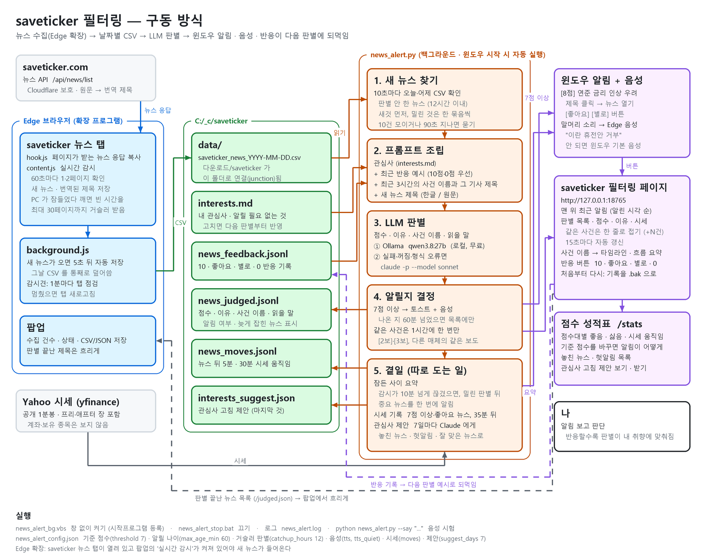
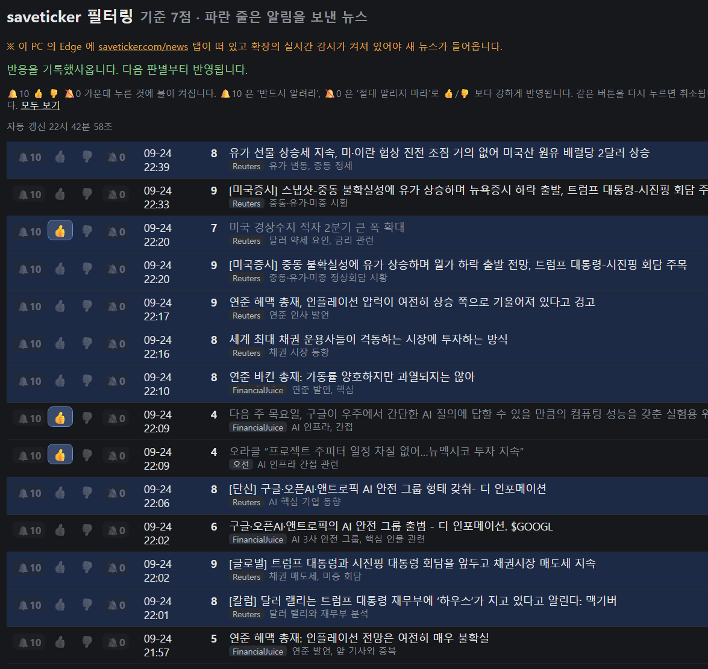
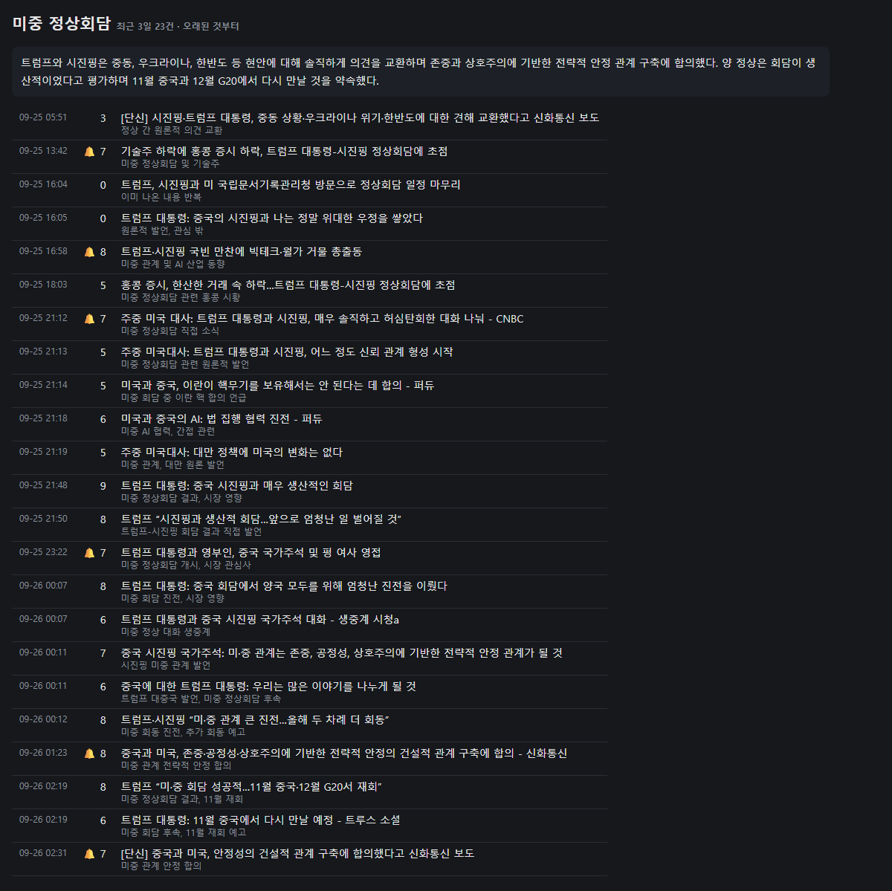
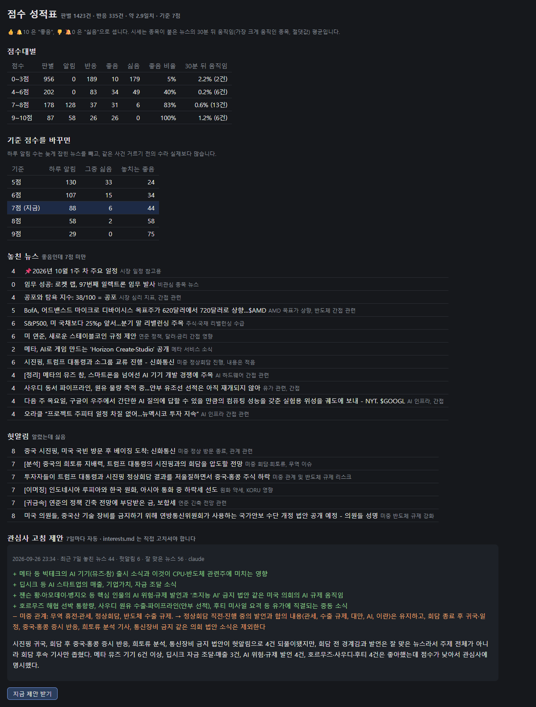
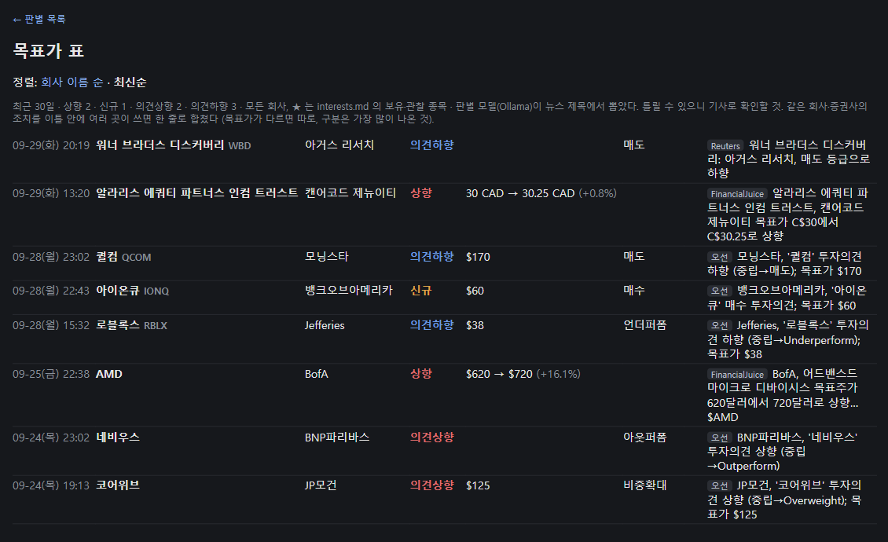
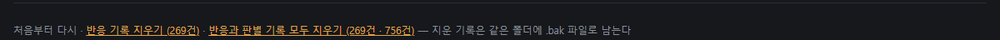

# saveticker 필터링

[세이브티커](https://saveticker.com/news) 뉴스를 모아서, LLM 이 내 관심사에 맞는 것만 골라 윈도우 알림으로 알려준다.

## 왜 만들었나

오선님의 세이브티커에 요즘 뉴스가 많이 늘었다. 그러다보니 내가 관심 없는 뉴스도 너무 많이 올라와서,
적당히 걸러 주는 페이지가 필요했다. 관심 있는 뉴스만 알림으로 받고, 👍/👎 로 반응할수록
내 취향에 맞게 걸러지도록 만들었다.

## 주의 사항

- **PC 의 Edge 에 https://saveticker.com/news 탭이 떠 있어야 한다.**
  - 뉴스는 이 탭 안에서 확장 프로그램이 모은다.
  - 탭을 닫거나 Edge 를 끄면 새 뉴스가 들어오지 않고, 판별과 알림도 멈춘다.
  - 확장 팝업의 **실시간 감시** 도 켜 두어야 한다.



```
Edge 확장 (extension/)          news_alert.py
  saveticker 뉴스 탭에서         data/*.csv 를 지켜보다가
  새 뉴스 수집 ──────────▶  날짜별 CSV  ──▶  LLM 판별 (ollama → 안 되면 claude CLI)
                              data/             7점 이상이면 윈도우 토스트 + 음성
                                                http://127.0.0.1:18765  판별 목록 · 🔔10 👍 👎 🔕0 반응
```

## 화면



- `http://127.0.0.1:18765` 의 판별 목록이다.
- 줄마다 점수·이유·제공처·사건 이름(보라색)이 보이고, 왼쪽 🔔10 · 👍 · 👎 · 🔕0 으로 반응한다.
- 파란 줄은 알림을 보낸 뉴스, 어두운 제목은 이미 반응한 뉴스다.
- 같은 사건의 뉴스는 한 줄로 접히고, **같은 사건 +N건** 을 누르면 펼쳐진다 (위 그림은 "후티 반군 드론 공격" 7건을 펼친 모습).
- 맨 위 파란 띠는 **최근 알림**이다.

## 구성

| 파일 | 역할 |
|---|---|
| `extension/` | Edge/Chrome 확장. 페이지가 받는 `/api/news/list` 응답을 기록하고, 실시간 감시로 1·2페이지를 주기적으로 확인한다. PC 가 잠들었다 깨는 등으로 빈 시간이 생기면 최대 30페이지까지 거슬러 받는다. 날짜별 CSV 를 `다운로드\saveticker\` 에 저장한다 |
| `news_alert.py` | CSV 의 새 뉴스를 판별해 알림을 띄우고, 판별 목록 페이지를 연다 |
| `targets.py` | 목표가 뉴스 고르기, 회사·증권사·목표가 뽑기 프롬프트, 같은 조치 합치기 (`/targets` 목표가 표) |
| `targets_db.py` | stocknews_filter 와 함께 쓰는 목표가 공용 DB |
| `interests.md` | 판별 기준이 되는 관심사. 고치면 다음 판별부터 반영된다 |
| `settings.py` | ⚙ 설정 창 (판별 목록 오른쪽 위) |
| `weekly_schedule.py` | "N주 차 주요 일정" 뉴스의 그림을 읽어 감자봇 일정에 넣는다 |
| `news_alert_config.json` | 설정. 저장소에는 없고, 처음 켤 때 기본값으로 만들어진다. 설정 창이 고쳐 쓴다 |
| `news_alert_bg.vbs` / `news_alert_stop.bat` | 창 없이 백그라운드 실행 / 종료 |

## 설치

1. `edge://extensions` → 개발자 모드 → **압축 풀린 파일 로드** → `extension` 폴더.
2. `다운로드\saveticker` 를 `data` 폴더로 잇는다 (확장은 다운로드 폴더 안에만 쓸 수 있다):
   ```
   mklink /J "%USERPROFILE%\Downloads\saveticker" "C:\_c\saveticker\data"
   ```
3. `pip install requests winotify edge-tts pywin32`, 그리고 터미널에서 `claude` 실행 후 `/login` 한 번.
   - ollama 가 켜져 있으면 그쪽을 먼저 쓴다 (`news_alert_config.json` 의 `model`).
4. `news_alert_bg.vbs` 실행. 로그는 `news_alert.log`.
5. saveticker 뉴스 탭을 열고 확장 팝업에서 **실시간 감시** 를 켠다.

## 판별

### 묻는 방법

- 새 뉴스를 최대 10건씩 모아(또는 90초 기다렸다가) 한 번에 묻는다.
- 프롬프트에는 `interests.md` 와 최근 반응(🔔10·👍·👎·🔕0)이 예시로 들어간다. 🔔10/🔕0 은 👍/👎 보다 우선한다.
- claude CLI 는 도구·MCP·설정을 모두 빼고 부른다 (10건에 입력 약 3천 토큰).
- `python news_alert.py --test 15` 로 최근 15건을 판별만 해 볼 수 있다.
  - `--before "2026-09-24 23:50"` 을 붙이면 그 시각까지의 뉴스로 되짚어 본다.

### 👎 까닭

- 👎·🔕0 을 누르면 그 줄 밑에 까닭 단추 10개가 뜬다.
  옛 기사 · 이미 본 내용 · 확정 안 된 설 · 숫자 없는 전망 · 개인 의견·투자 조언 ·
  수상·협약·홍보 · 단순 시세·수급 · 관심 없는 나라·업종 · 사건·사고 가십 · 그 밖에 시장 영향 적음.
- 고른 까닭은 반응 기록에 함께 남고, 프롬프트의 과거 반응에 "👎 제목 (까닭: 확정 안 된 설)" 처럼 들어간다.
- 누른 줄은 까닭을 고를 수 있게 30초 동안 목록에 남는다.

### 사건 이름

- 뉴스마다 **사건 이름**(예: "트럼프 시진핑 회담")도 붙인다.
- 발언 한 문장마다 뜨는 속보, [2보]·[3보], 다른 매체의 같은 보도가 한 이름으로 묶인다.
- 최근 3시간의 사건 이름을 그 기사 제목과 함께 프롬프트에 넣어, 같은 사건이면 같은 이름을 다시 쓰게 한다.
  나라·인물만 겹치는 다른 일은 새 이름을 붙인다.
- 알림은 **같은 사건이면 한 시간에 한 번** 만 보낸다.

### SAVE PICK (오늘 주요뉴스)

- 세이브티커 "오늘 주요뉴스"(편집자가 고른 SAVE PICK, 하루 5건 안팎)는 확장이 1분마다 목록과 함께 받아 제목 앞에 `[SAVE PICK]` 을 붙인다.
- 판별기는 이 뉴스에 LLM 점수와 상관없이 **9점**을 준다.
- 판별한 뒤에 뽑힌 뉴스도 9점으로 올리고, 나온 지 60분 안이면 알린다.
- 음성은 "세이브, 이란 휴전안 거부" 처럼 읽는다.
- 판별 목록 위 **🔥 주요뉴스만** (`/?pick=1`) 을 누르면 이 뉴스만 모아 본다.

### 음성

- 알림은 말로도 읽는다. 말머리 소리 뒤에 LLM 이 제목을 줄인 말("이란 휴전안 거부")을 Edge 음성으로 읽는다.
- Edge 음성이 안 되면 윈도우 기본 음성으로 읽는다.
- `tts: false` 로 끄고, `tts_quiet: "23-07"` 처럼 말하지 않을 시간을 둔다.
- `python news_alert.py --say "이란 휴전안 거부"` 로 들어 볼 수 있다.

### 늦은 뉴스와 잠든 사이

- 나온 지 60분(`max_age_min`)이 넘은 뉴스는 판별해 목록에만 올리고 알리지 않는다.
- PC 가 잠든 사이 쌓인 뉴스는 12시간(`catchup_hours`)까지 거슬러 판별한다.
- PC 가 잠들었다 깨면(감시가 10분 넘게 끊기면) 밀린 판별이 끝난 뒤 **잠든 사이 중요 뉴스**를 한 번에 알린다.
  - 예: "잠든 사이 중요 뉴스 3건. 미-이란 휴전 협상, 솔리다임 IPO 검토, …"
  - 잠들기 전에 이미 알린 사건은 뺀다.

## 더 보기

### 수집 멈춤 알림

- 확장의 감시견이 1분마다 판별기에 소식(`/ping`)을 보낸다.
- 아래 가운데 하나면 토스트로 한 번 알리고 목록 맨 위에 빨간 줄을 띄운다. 다시 되면 또 한 번 알린다.
  - 5분 넘게 소식이 없다
  - 뉴스 탭이 닫혔다
  - 실시간 감시가 꺼졌다
  - 감시가 10분째 뉴스를 못 받는다

### 목록 길이와 최근 알림

- 처음에는 최근 뉴스 50개만 싣는다 (묶음 안의 뉴스도 센다). 맨 아래 **더 보기** 로 50개씩 늘린다.
- 목록 맨 위 **최근 알림** 줄은 알린 시각 순이다. 목록은 기사 시각 순이라 늦게 들어온 알림이 아래에 묻히기 때문이다.

### 시세 움직임

- 기준 점수 이상이거나 👍 받은 뉴스에 종목이 붙어 있으면, 35분 뒤 yfinance 1분봉(공개 시세)으로 뉴스 시각에서 5분 뒤·30분 뒤 몇 % 움직였는지 적는다.
- 목록에 `SNDK +0.6% → +1.2%` 처럼 붙는다.
- 장이 닫혀 있던 뉴스는 적지 않는다. 기록은 `news_moves.jsonl` (`moves: false` 로 끈다).

### 시장 반응

- 판별한 모든 뉴스에 30분 뒤 나스닥(QQQ)·반도체(SOXX)·미 10년물 금리(^TNX, bp)·유가(USO) 움직임을 붙인다.
- 종목이 없는 금리·유가·관세 뉴스도 시장이 어떻게 받았는지 보인다 (`시장 나스닥 +0.3% · 10년물 -1bp …`).
- 나스닥·반도체 ±0.5%, 10년물 ±3bp, 유가 ±1% 를 넘으면 노란색.
- 점수가 낮은 뉴스에도 적는 것은 성적표에서 "점수가 높을수록 시장이 더 움직였나" 를 견주려고다.

### 장 열기 전 브리핑 (`/briefing`)

- 평일 21:00(`briefing_at`)에 지난 12시간의 7점 이상 뉴스를 사건별로 묶어, 점수 높은 사건 다섯 가지를 읽고 토스트로 띄운다.
- PC 가 그때 잠들어 있었으면 깬 뒤 2시간 안에 한다.
- 페이지의 버튼으로 바로 만들 수도 있다.

### 사건 타임라인

- 보라색 사건 이름을 누르면 그 사건의 최근 3일 뉴스를 오래된 것부터 보여 준다.
- **흐름 요약** 버튼은 LLM 에게 사건이 어떻게 흘러왔는지 한두 문장으로 묻는다.



### 점수 성적표 (`/stats`)

- 점수대별 반응(좋음·싫음)과 30분 뒤 시세 움직임을 본다.
- 기준 점수를 5 → 9 로 바꾸면 하루 알림 수·헛알림·놓치는 뉴스가 어떻게 되는지 보인다.
- 놓친 뉴스와 헛알림 목록이 나온다.

### 관심사 고침 제안

- 성적표 아래. 최근 7일 반응을 보고 `interests.md` 에 더하거나 고칠 줄을 LLM 이 제안한다.
- 7일(`suggest_days`)마다 저절로 만들고 토스트로 알린다. 버튼으로 바로 받을 수도 있다.
- **`interests.md` 는 고치지 않는다.** 고칠지는 직접 정한다. 제안은 `interests_suggest.json`.



### 설정 창 (⚙ 설정)

판별 목록 오른쪽 위 "⚙ 설정" 을 누르면 펼쳐진다. 바꾸면 바로 적용되고 `news_alert_config.json` 에 쓴다. 다시 띄울 필요가 없다.

- **알림**: 윈도우 알림 켜고 끄기, 기준 점수(5 → 10점), 알림 시한(30 → 360분).
- **소리**: 음성으로 읽기, 목소리(인준·선희·현수), 빠르기, 말머리 소리, 조용한 시각(예: 23:00 → 07:00), 읽기 시험 단추.
- **브리핑 · 요약**: 장 전 브리핑 켜고 끄기와 시각, 담을 기간과 사건 수, 깨어난 뒤 요약에서 읽을 수, 잠든 것으로 보는 시간, 밀린 뉴스를 거슬러 판별할 시간.
- **판별**: 판별 LLM(Ollama 먼저 / Ollama 만 / Claude 만), Claude 모델, Ollama 모델, 관심사 제안 주기와 제안 LLM, 목록에서 숨길 점수.
- 포트, 시세 움직임 적기처럼 다시 띄워야 듣는 것은 창에 넣지 않았다. 설정 파일을 직접 고친다.

### 목표가 표 (`/targets`)



- 최근 30일 애널리스트 목표가·투자의견 조치를 모은다. stocknews_filter 의 목표가 표를 옮긴 것이다.
- 관찰 종목만이 아니라 모든 회사를 모으고, `interests.md` 의 보유·관찰 종목이면 ★ 를 붙인다.
- 정렬은 두 가지다.
  - **최신순** (기본): 모든 회사를 한 표에 새것부터.
  - **회사 이름 순** (`?o=name`): 회사마다 칸을 나눈다.
- 화면은 폭 660px 의 좁은 표가 기본이다. PC 에서 캡처해 메신저로 보내면 받는 쪽은 휴대폰으로 보기 때문이다.
  - 날짜는 `10-01 15:44` 처럼 월-일 시:분으로 적고, 최신순 표의 회사 칸은 티커로 적는다 (한국 종목과 티커를 모르는 회사는 이름).
  - "넓게 보기" 를 누르면 넓은 표가 되고, 고른 쪽을 브라우저가 기억한다.
- **골라 보기**: 기간(30일 전체 · 오늘 · 3일 · 7일)을 고르고, "유지·제시 빼기" 를 켜면 상향·하향·신규·의견 변경만 남는다.
  - 브라우저에서 줄을 감추기만 하고, 고른 것을 기억한다. 옆에 "4 / 57줄" 처럼 남은 줄 수가 나온다.
- **그림으로 복사**: 표 위 20줄 / 40줄 / 전체를 PNG 그림으로 만들어 클립보드에 넣는다. 골라 보기로 감춘 줄은 담지 않는다.
  - 그림 맨 위에 날짜와 고른 조건이 적힌다 (`목표가 표 · 10-01 (오늘, 유지·제시 뺌)`).
  - 여러 곳이 쓴 줄은 그림에서 펼칠 수 없으므로 첫 기사 제목과 "외 N곳" 을 적는다. 메신저 창에 붙여 넣으면 된다.
  - 클립보드가 막혀 있으면 `targets.png` 파일로 내려 준다. 바깥 라이브러리 없이 브라우저만으로 그린다.
- 제목에 목표가 낱말(price target, upgrade, 목표가, 투자의견 등)이 든 뉴스만 골라, 판별과 따로 Ollama 에 묻는다 (`targets.py`, 1분마다).
  - 묻는 것: 회사·티커·증권사·구분(상향·하향·유지·신규·의견상향·의견하향·제시)·투자의견·목표가.
    "제시" 는 목표가만 적혀 있고 올렸는지·내렸는지 제목으로 알 수 없는 것이다.
  - Ollama 에 먼저 묻고, 꺼져 있으면 Claude 에 묻는다. Ollama 를 끈 동안 들어온 목표가 뉴스가 표에 안 올라와서 10-01 에 바꿨다.
- 목표가는 stocknews_filter 와 함께 쓰는 공용 SQLite 파일에 적는다 (`targets_db.py`, 두 저장소에 같은 파일).
  - 위치는 환경변수 `STOCK_TARGETS_DB`, 없으면 사용자 폴더의 `.stock_targets/targets.db`.
  - 줄마다 어느 알리미가 뽑았는지(`origin`)와 기사 제목·링크·언론사를 함께 적는다. 그래서 한쪽이 꺼져 있어도 다른 쪽 표에 보인다.
  - 이 표에는 두 알리미가 뽑은 것이 모든 회사 다 보인다. 같은 조치는 티커로 맞춰 한 줄에 합친다.
  - 09-30 전 기록 `news_targets.jsonl` 은 처음 켤 때 공용 DB 로 옮기고, 파일은 그대로 둔다.
- 개인 필자 글, 보유 지분 공시, 컨센서스, 업종 전체 의견, 임상시험 "Initiation" 같은 것은 뺀다. 목표가 숫자는 제목에 적힌 것만 쓴다.
- 같은 회사·증권사의 조치를 이틀 안에 여러 곳이 쓰면 한 줄로 합친다.
- 09-29 에 쌓여 있던 후보 13건에서 8건을 뽑았다.
  - 처음에는 "Underperform" 을 아웃퍼폼으로 적은 것, 한국어 제목의 회사와 증권사를 뒤바꿔 적은 것이 한 건씩 있었다.
  - 프롬프트에 의견 대응표와 한국어 제목 모양을 넣고 다시 뽑으니 8건 모두 맞았다.

## 주간 일정을 감자봇 일정에 넣기

세이브티커의 오선은 토요일 저녁에 "📌2026년 10월 2주 차 주요 일정" 같은 뉴스를 올린다.
글은 없고 그림만 8장쯤 있다 (표지, 이번 주 핵심 일정, 요일별 5장, 주간 실적 한눈에).
이 뉴스가 들어오면 그림을 모두 읽어 감자봇(따로 만든 카카오톡 비서)의 일정에 넣는다 (`weekly_schedule.py`).

- 설정 파일의 `kakao_dir` 에 감자봇 폴더를 적어야 돈다. 비어 있으면 하지 않는다 (기본).
- 5분마다 최근 3일 뉴스에서 제목이 "N월 N주 차 주요 일정" 이고 올린 이가 오선인 것을 찾는다. 한 뉴스는 한 번만 읽는다 (`weekly_done.json`).
- 그림은 뉴스 상세 주소에서 받아 claude CLI(`weekly_model`, 기본 sonnet)에 8장을 한꺼번에 보여 준다. 한 번에 75초쯤 걸린다.
- 감자봇에 이미 있는 일정을 프롬프트에 함께 주고, 같은 일이면 표시하게 해서 넣지 않는다. 티커가 같은 실적 발표도 넣지 않는다.
- 시각이 그림에 있으면 그 한국시간으로 넣는다. 감자봇이 한 시간 전에 주식방에 알린다. 새벽(0 → 8시) 일정은 전날 밤 10시에 알린다.
- 배당락과 작은 회사 실적은 넣지 않는다. 작은 회사는 "주간 실적 한눈에" 장에만 있고 시각이 없는 것으로 가린다.
- 그 밖에 시각이 없는 일정은 날짜만 넣고 그날 아침 8시에 알린다.
- 10-04 에 10월 2주 차 뉴스로 처음 돌렸다. 51건을 뽑았다. 25건이 들어갔다. 이미 있던 8건(ISM 서비스업 PMI, FOMC 의사록, 펩시 실적 등), 배당락 5건, 작은 회사 실적 13건은 뺐다.
- `python weekly_schedule.py --dry` 로 넣을 것만 미리 볼 수 있다.

## 처음부터 다시

- **새로 쓰는 사람**: 이 저장소의 `interests.md` 는 만든 사람의 관심사다. 먼저 내 관심사로 고쳐 쓴다.
  반응 기록과 판별 기록은 저장소에 없으니 빈 상태에서 시작한다.
- **쓰던 기록을 지우고 싶을 때**: 판별 목록 페이지 맨 아래 **처음부터 다시** 에서

  

  - *반응 기록 지우기*: 🔔10·👍·👎·🔕0 기록만 지운다. 판별기는 관심사만 보고 다시 배운다.
  - *반응과 판별 기록 모두 지우기*: 목록까지 비운다. 최근 12시간(`catchup_hours`) 안의 뉴스는 다시 판별한다 (알림은 60분 안의 것만).
- 누르면 지울 건수를 보여 주며 **한 번 더 묻는다.**
- 지운 기록은 실제로 지우지 않고 `news_feedback.<시각>.bak.jsonl` 처럼 이름만 바꿔 같은 폴더에 남긴다. 되살리려면 이름을 원래대로 바꾸면 된다.

## 라이선스

[MIT](LICENSE)
